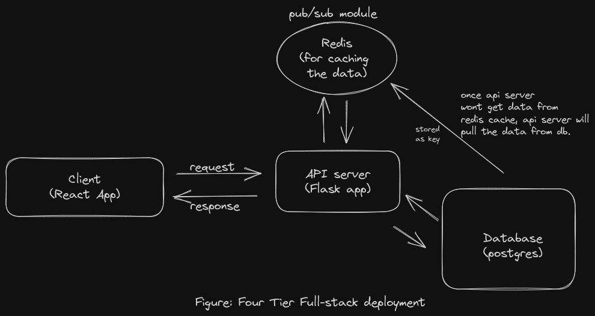

# Redis_PubSub_Caching_Schema
`Kind of a directional event drive system with the help of 
Flask(python), React, Database(postgres), In-memory-Cache(Redis), Docker and Docker Compose`

## The draw architectural drawing of a full-stack system

**Four Tier Application**:

 
<figure>
<figcaption align="center">Fig: Full-stack System</figcaption>
</figure>
 

### Just clone the repo and navigate to the top directory and simply run the below command:
* `docker-compose up --build -d`

#### This command will up and run the project. 
you need to browse the link [http:localhost:5173](http:localhost:5173) for access the web-site. 

